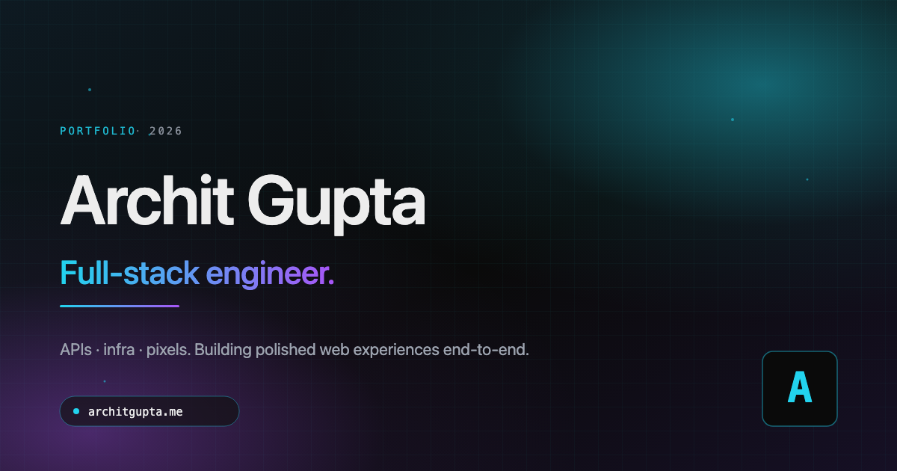

# architgupta.me

Personal portfolio of **Archit Gupta** — full-stack software engineer. Built end-to-end with Astro, Tailwind, and Three.js.

**Live:** [architgupta.me](https://architgupta.me) · **Source:** github.com/archit2901/portfolio



---

## Stack

| Layer | Tech |
|---|---|
| Framework | [Astro 5](https://astro.build/) (static SSG, zero-JS-by-default) |
| Styling | [Tailwind CSS](https://tailwindcss.com/) |
| 3D | [Three.js](https://threejs.org/) (lazy-loaded only on the hero) |
| Language | TypeScript (strict) |
| Fonts | Inter Variable + JetBrains Mono Variable (self-hosted) |
| Hosting | [Vercel](https://vercel.com/) (static output) |
| SEO | `@astrojs/sitemap`, JSON-LD `Person` schema, OG image |

## What's in here

- **Single-page landing** (`/`) with sections: hero, about, experience, skills, projects, education, FAQ, contact
- **Standalone projects archive** (`/projects`) with filter chips by category
- **Custom 404** styled as a `cat / ls /` terminal session
- **`⌘K` command palette** — fuzzy-search navigation, downloads, motion-reduce toggle
- **Keyboard shortcuts** — `g a` / `g e` / `g d` / `g p` / `g f` / `g c` for section jumps, `?` opens the palette
- **Console signature** — open DevTools and you'll find a stylized hello
- **Build-stamp footer** — version, framework, gzipped JS size, last-built date
- **Mobile collapsibles** — About bio, Experience bullets, Projects descriptions, Skills categories all collapse on `<768px` with a `<details>` accordion that auto-opens on desktop

## Animation highlights

- Three.js wireframe globe with arc traffic in the hero (lazy-loaded, falls back to a CSS gradient if WebGL is unavailable)
- Typewriter terminal in the hero with a believable shell session and a blinking caret
- Cyan→violet conic-gradient borders on the navbar Résumé button and the Experience "Currently" card, animated via `@property --angle`
- Cursor-following spotlight on Skills, Projects, and Contact cards
- 3D tilt with layered `translateZ` z-depth on Skills + Projects cards
- Magnetic micro-translate on every card hover
- Scroll-driven parallax backdrop on each section
- Reveal cascade as each section enters the viewport
- Every animation respects `prefers-reduced-motion`, both OS-level and via the palette's manual toggle (persisted in `localStorage`)

## Single source of truth

All site content (copy, links, project descriptions, FAQ Q&A, build stamp, palette strings) lives in [`src/content/site.ts`](src/content/site.ts). Components import only what they need. Editing the site means editing this one file.

## File layout

```
src/
├── components/
│   ├── about/        Bio + portrait + bento facts
│   ├── command/      ⌘K palette
│   ├── contact/      Email card + link tiles + status strip
│   ├── education/    School cards with coursework chips
│   ├── experience/   Bento of role cards (collapsible bullets)
│   ├── faq/          Accordion of recruiter-targeted Q&A
│   ├── hero/         Three.js scene + typewriter terminal
│   ├── projects/     Featured trio + shared ProjectCard
│   ├── skills/       6 category cards with chip stagger
│   ├── Navbar.astro
│   └── Footer.astro
├── content/
│   └── site.ts       ← all copy & links live here
├── layouts/
│   └── BaseLayout.astro
├── pages/
│   ├── index.astro
│   ├── 404.astro
│   └── projects/index.astro
└── styles/global.css
```

## Local development

Requires Node 20+.

```bash
npm install
npm run dev          # http://localhost:4321
npm run build        # static output → dist/
npm run preview      # serve the built site locally
npx astro check      # type + diagnostics check
```

## Deploying

Auto-deploys to Vercel on push to `main`. The [`vercel.json`](vercel.json) at the root pins the framework preset to Astro (overrides any stale dashboard setting). Sitemap and OG image are emitted at build.

## License

Source is public for reference. Please don't re-host as your own portfolio.

---

Built with [Claude Code](https://claude.com/claude-code) as the pairing partner.
